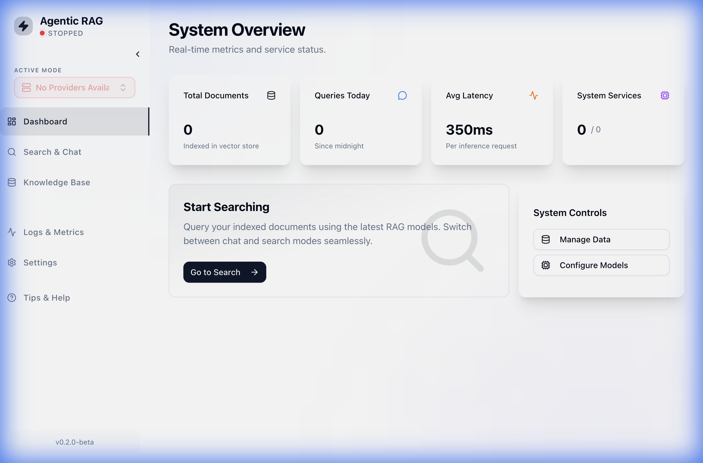
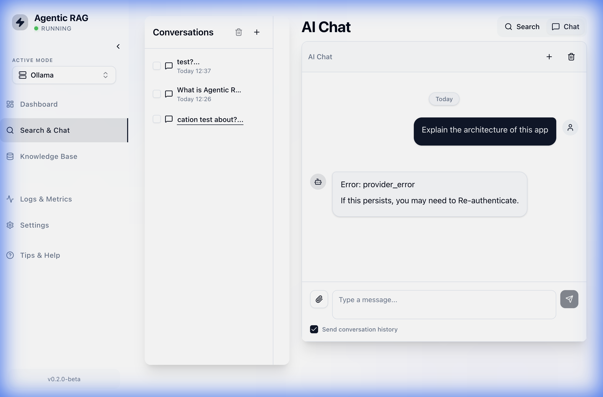
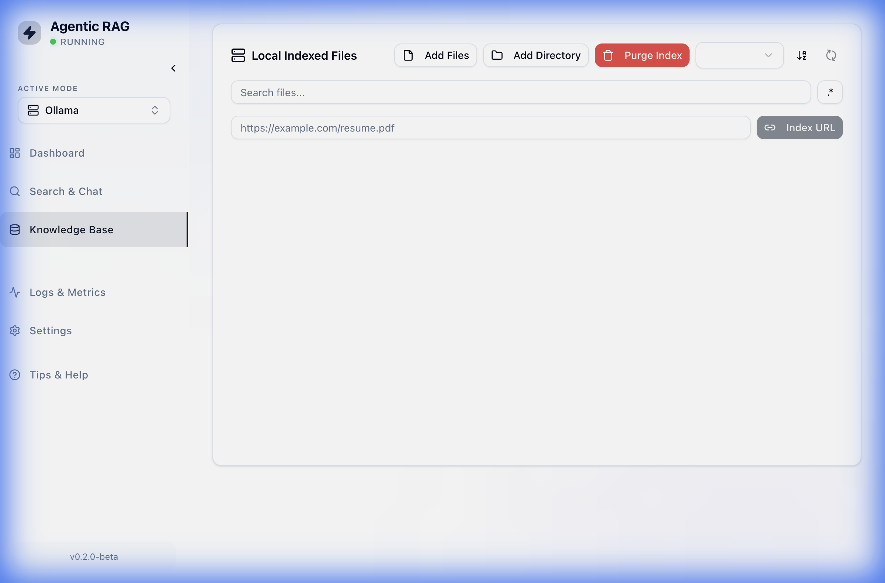
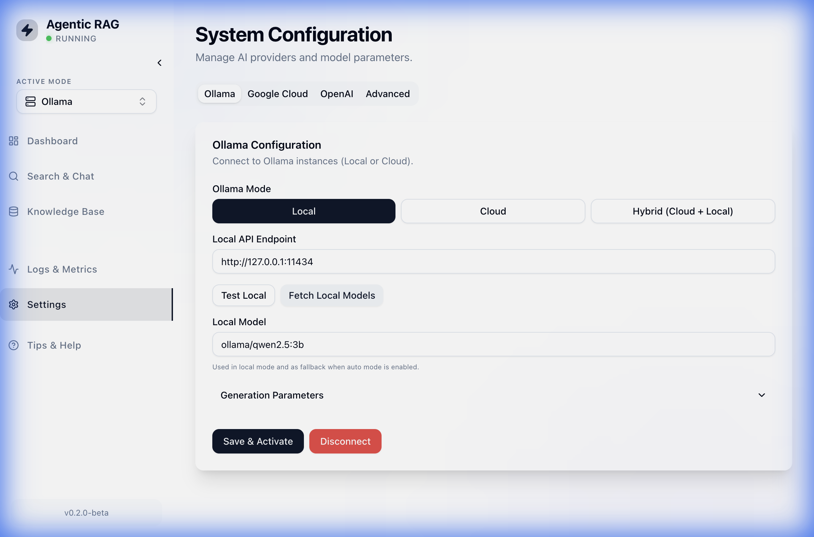

# Application Walkthrough

This document demonstrates the key features of the Agentic RAG application.

## Dashboard
The home page provides an overview of the system status and metrics.

## Chat Interface
Users can interact with the RAG system to ask questions about their indexed documents.

## Knowledge Base
Manage documents and files for indexing.

## Settings
Configure AI providers (Ollama, OpenAI, Google) and system preferences.

